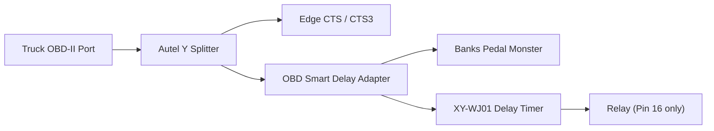
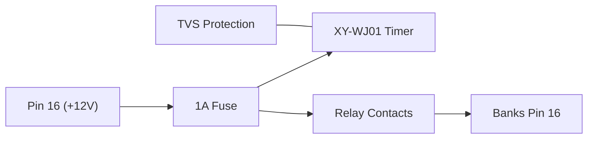

# OBD Smart Delay Adapter

> Automatically delays power to a Banks Pedal Monster while allowing an Edge CTS/CTS3 to fully initialize and discover vehicle PIDs.

---

## Overview

Some vehicles exhibit communication conflicts when multiple OBD-II devices initialize simultaneously.

In this case:

- Edge CTS/CTS3 fails to load all PIDs if the Banks Pedal Monster is already active.
- If the CTS initializes first, then the Pedal Monster is connected afterward, both devices operate normally.

This project automates that startup sequence.

Instead of manually unplugging or switching the Banks Pedal Monster, this module delays **only OBD-II Pin 16 (+12V)** to the Banks device while allowing all CAN communication wiring to remain intact.

The result is:

- Edge initializes normally
- Banks powers on automatically after a configurable delay
- Reverse detection and all Pedal Monster safety features remain operational
- No modification to the truck
- No modification to the Autel splitter
- Completely reversible

---

# Features

- Delays only OBD-II Pin 16
- CAN bus remains uninterrupted
- Adjustable startup delay
- Inline plug-and-play module
- Automotive transient protection
- Serviceable design
- OEM-style construction

---

# System Architecture



---

# Power Flow



---

# Startup Sequence

```text
Ignition ON

↓

Edge CTS powers immediately

↓

CTS discovers all supported PIDs

↓

Timer starts

↓

10 second delay

↓

Relay closes

↓

Banks Pedal Monster powers on

↓

Normal operation
```

---

# Design Goals

This project was designed with the following priorities:

* Reliability
* Reversibility
* Serviceability
* OEM appearance
* Minimal electrical modification
* Protection from automotive transients

---

# Electrical Design

Only **OBD-II Pin 16** is switched.

The following pins pass directly through:

| Pin | Function |
|------|----------|
|1-15|Straight through|
|4|Ground|
|5|Signal Ground|
|6|CAN High|
|14|CAN Low|

Only Pin 16 is interrupted.

```
Truck Pin16
      │
      ▼
     Fuse
      │
      ▼
 Timer Module

      │

 Relay COM

 Relay NO

      │

Banks Pin16
```

---

# Hardware

## Enclosure

- LeMotech Waterproof ABS Enclosure

## Timer

- XY-WJ01 Digital Delay Relay

## Protection

- 1A Inline Fuse
- 1.5KE18CA TVS Diode

## Wiring

- 18 AWG Automotive Wire
- Adhesive-lined Heat Shrink
- PET Braided Loom
- Tesa Harness Tape

---

# Why not switch the CAN bus?

The CAN bus remains connected at all times.

Only device power is delayed.

Advantages:

- Maintains proper CAN termination
- No interruption of network wiring
- Eliminates unnecessary switching of high-speed differential signals
- Simplifies the design

---

# Bench Testing

Before connecting to a vehicle:

1. Verify connector pinout with a multimeter.
2. Verify continuity on Pins 1-15.
3. Verify Pin 16 is open before timer expires.
4. Apply 12V power.
5. Verify relay closes after programmed delay.
6. Verify Pin16 continuity after relay closes.

---

# Vehicle Testing

1. Connect adapter between Autel splitter and Banks Pedal Monster.
2. Leave Edge connected normally.
3. Turn ignition ON.
4. Verify Edge loads all PIDs.
5. Wait for timer.
6. Verify Banks powers on.
7. Start engine.
8. Verify reverse detection.
9. Verify throttle response.

---

# Future Improvements

Version 2 may replace the timer module with a microcontroller.

Possible enhancements:

- Voltage stabilization detection
- Engine-running detection
- CAN activity detection
- Configurable delay profiles
- OLED status display
- Diagnostic logging
- USB configuration

---

# License

MIT License

---

# Disclaimer

This project is provided as-is.

Use at your own risk.

The author assumes no responsibility for damage to vehicle electronics or connected equipment.

Always verify wiring with a multimeter before applying power.

---

# Acknowledgements

Special thanks to the automotive electronics community for documenting Edge CTS and Banks Pedal Monster coexistence issues, which inspired this project.
