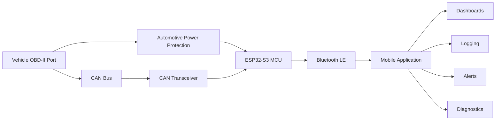
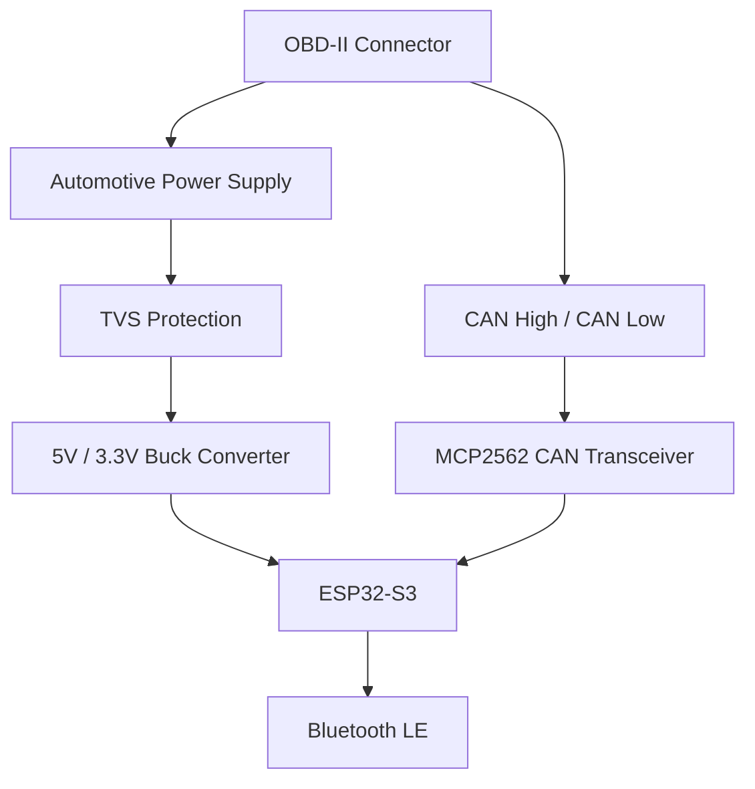
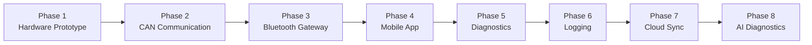

# Bluetooth CAN Monitor

## An Open-Source Edge CTS3 Alternative

> A modern Bluetooth OBD-II/CAN gateway and mobile application designed for real-time vehicle monitoring, diagnostics, and logging.

---

# Overview

This project aims to build a modern alternative to the Edge CTS3 by separating the hardware from the display.

Instead of using a dedicated touchscreen, a compact Bluetooth gateway interfaces with the vehicle's CAN bus and streams high-speed telemetry to an iOS or Android application.

The goal is to create a platform that is:

* Faster than traditional ELM327 devices
* Expandable through software updates
* Customizable with user-defined dashboards
* Capable of logging and exporting vehicle data
* Modular enough to support multiple manufacturers
* Open for community development

---

# Project Goals

* Real-time CAN monitoring
* Bluetooth Low Energy communication
* High-speed PID polling
* Manufacturer-specific PID support
* Data logging
* Diagnostic Trouble Code (DTC) support
* Custom dashboards
* OTA firmware updates
* Predictive maintenance
* AI-assisted diagnostics

---

# System Architecture



---

# Hardware Architecture



---

# Software Architecture

```mermaid
flowchart TD

Start

Start --> CANInit

CANInit --> Discover

Discover --> Poll

Poll --> Decode

Decode --> Alerts

Decode --> Dashboard

Decode --> Logging

Logging --> Storage

Dashboard --> Bluetooth

Bluetooth --> Phone
```



---

# Supported Data

## Standard OBD-II PIDs

| PID                    | Description      |
| ---------------------- | ---------------- |
| RPM                    | Engine Speed     |
| Vehicle Speed          | Ground Speed     |
| Coolant Temperature    | Engine Cooling   |
| Intake Air Temperature | Turbo Efficiency |
| Manifold Pressure      | Engine Load      |
| Calculated Load        | Engine Stress    |
| Fuel Rate              | Fuel Consumption |
| Battery Voltage        | Charging System  |

---

# Ford Enhanced PIDs

## Turbo

* Boost Pressure
* Desired Boost
* Actual Boost
* Turbo Vane Position
* Turbo Speed (where available)

## Engine

* Oil Temperature
* Oil Pressure
* Fuel Rail Pressure
* Injection Timing
* Engine Torque
* Injector Pulse Width

## Transmission

* Transmission Temperature
* Torque Converter Slip
* Current Gear
* Commanded Gear
* Line Pressure

## Exhaust

* DPF Soot Percentage
* Ash Load
* Exhaust Differential Pressure
* Exhaust Back Pressure
* Regeneration Active
* Regeneration Requested
* Regeneration Inhibited

## DEF / SCR

* DEF Level
* DEF Temperature
* DEF Pump Pressure
* NOx Sensor 1
* NOx Sensor 2
* SCR Efficiency

## Exhaust Gas Temperature

* EGT1
* EGT2
* EGT3
* EGT4

## Cooling

* Coolant Temperature
* Fan Speed
* Desired Fan Speed
* Oil Temperature

## Electrical

* Battery Voltage
* Alternator Load
* Glow Plug Status

## Drivetrain

* Transfer Case Position
* Locker Status
* Steering Angle
* Four-Wheel Drive Mode

---

# Dashboard Philosophy

Instead of one crowded dashboard, information is grouped by driving scenario.

---

## Daily Driving

* RPM
* Boost
* Coolant Temperature
* Transmission Temperature
* Battery Voltage
* Fuel Economy

---

## Towing

* Boost Pressure
* Transmission Temperature
* Engine Oil Temperature
* Exhaust Gas Temperature
* Fuel Rail Pressure
* Coolant Temperature

---

## DPF Monitoring

* DPF Soot Percentage
* Regen Status
* Regen Requested
* Distance Since Last Regen
* EGT3
* EGT4

---

## Engine Health

* Oil Pressure
* Oil Temperature
* Fuel Pressure
* Battery Voltage
* Turbo Vane Position

---

## Performance

* Boost
* Rail Pressure
* RPM
* Throttle Position
* Turbo Vane %
* Transmission Gear

---

## Off-Road

* Pitch
* Roll
* Altitude
* Steering Angle
* Transfer Case
* Locker Status
* Outside Temperature

---

# Recommended Display Layout

```
+------------------------------------------------+
| Boost                28 psi                    |
+------------------------------------------------+
| Transmission Temp    178°F                     |
+------------------------------------------------+
| Coolant Temp         194°F                     |
+------------------------------------------------+
| Oil Temp             201°F                     |
+------------------------------------------------+
| DPF Soot             42%                       |
+------------------------------------------------+
| Regen                OFF                       |
+------------------------------------------------+
```

The interface should prioritize readability over decorative analog gauges.

---

# Color Strategy

| Status      | Color |
| ----------- | ----- |
| Normal      | White |
| Healthy     | Green |
| Information | Blue  |
| Warning     | Amber |
| Critical    | Red   |

Dark backgrounds with high-contrast text improve visibility in both daylight and nighttime driving.

---

# Future Features

* Vehicle Profiles
* Automatic PID Discovery
* Trip Recording
* Route Mapping
* Maintenance Tracking
* Cloud Synchronization
* AI Diagnostic Assistant
* Predictive Maintenance
* Custom User Gauges
* Over-the-Air Firmware Updates
* CAN Bus Recorder
* Export to CSV, JSON, and SQLite

---

# Long-Term Vision

The ultimate goal is to build an extensible automotive monitoring platform rather than a dedicated gauge display.

By combining a compact ESP32-based Bluetooth gateway with a modern mobile application, the project can evolve beyond the capabilities of traditional in-cab monitors. Features such as customizable dashboards, cloud-synchronized logs, predictive diagnostics, firmware updates, and manufacturer-specific CAN decoding will allow the platform to grow alongside the vehicles it supports while remaining open, modular, and community-driven.

---

# Development Roadmap



---

# License

This project is intended to be released as an open-source platform to encourage collaboration, vehicle support, and community-driven enhancements.
