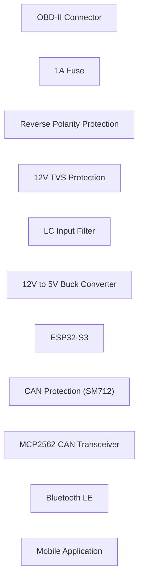
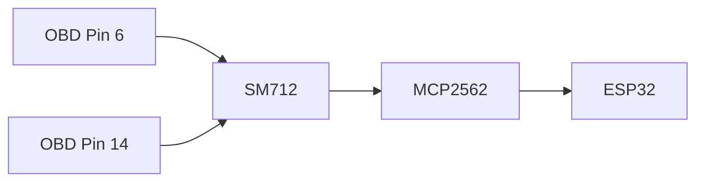
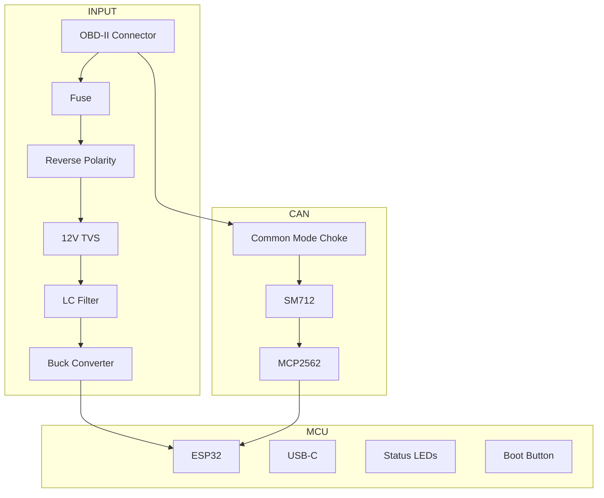

# Hardware Design Guide

## Bluetooth OBD-II CAN Gateway (V1)

> This document describes the electrical architecture for Version 1 of the Bluetooth CAN Gateway. The goal is to build a robust, automotive-grade device capable of remaining connected to a vehicle for long periods without risking damage from the harsh automotive electrical environment.

---

# Design Philosophy

Unlike a hobby Arduino project, this gateway is intended to be designed using automotive best practices.

The design priorities are:

* Vehicle safety
* Electrical protection
* Long-term reliability
* Expandability
* Ease of manufacturing
* Open-source hardware

---

# System Overview



---

# Hardware Components

| Component                 | Purpose                                   |
| ------------------------- | ----------------------------------------- |
| ESP32-S3                  | Main processor, Bluetooth, Wi-Fi          |
| MCP2562 (or TJA1051)      | CAN Bus Transceiver                       |
| OBD-II Male Connector     | Vehicle interface                         |
| Automotive Buck Converter | 12V → 5V power                            |
| TVS Diodes                | Spike suppression                         |
| Fuse                      | Over-current protection                   |
| Reverse Polarity MOSFET   | Prevent accidental reverse battery damage |
| USB-C                     | Programming and debugging                 |

---

# Why Automotive Protection Matters

A vehicle electrical system is **not** a stable 12V power supply.

Typical operating voltage:

```text
Engine Off
11.8V - 12.6V

Engine Running
13.6V - 14.8V
```

However, during events such as:

* Starter motor operation
* Alternator load dump
* Battery disconnect
* Jump starting
* Inductive loads switching

Voltage can momentarily exceed **60–100V**.

Without proper protection, the ESP32, CAN transceiver, or voltage regulator can be permanently damaged.

---

# Power Protection Circuit


---

# 12V TVS Diode

This TVS diode protects the **entire power supply**.

## Location

The TVS diode is connected **between the +12V input and Ground**.

It is **not** placed in series with the power line.

```text
               +12V
                 │
                 │
                 ├──── TVS ──── Ground
                 │
             Buck Converter
```

---

## Purpose

The TVS diode absorbs:

* Load dump
* Starter spikes
* Alternator spikes
* Reverse transients
* High-energy voltage surges

During normal operation the TVS does nothing.

When voltage exceeds its clamping threshold, it rapidly conducts to ground, protecting the downstream electronics.

---

## Recommended Device

Example:

* SMBJ58A (automotive-rated TVS)

Typical characteristics:

* High surge capability
* Fast response
* Designed for 12V automotive systems

---

# CAN Bus Protection

The CAN network also requires protection.

The communication wires are exposed directly to the vehicle.

Protection is provided using a dedicated CAN TVS diode.

---

# SM712 TVS

Unlike the power TVS, the SM712 protects only the CAN communication lines.



---

## Purpose

Protects against:

* Electrostatic discharge (ESD)
* Electrical noise
* Inductive spikes
* Wiring faults

Without this protection, the CAN transceiver is vulnerable to damage.

---

# Common Mode Choke

For additional robustness, place a common-mode choke ahead of the CAN transceiver.

```text
OBD Pin 6
      │
Common Mode Choke
      │
SM712
      │
CANH

OBD Pin14
      │
Common Mode Choke
      │
SM712
      │
CANL
```

Benefits:

* Reduces EMI
* Improves signal quality
* Improves automotive EMC performance

---

# Reverse Polarity Protection

Accidentally reversing battery polarity should never destroy the device.

Instead of a simple diode, use a **P-channel MOSFET** configured for reverse polarity protection.

Advantages:

* Very low voltage drop
* Low heat generation
* Higher efficiency
* Common in automotive electronics

---

# Buck Converter

Recommended characteristics:

* Automotive rated
* Wide input voltage (9–36V minimum)
* 5V output
* 3A minimum output current
* High efficiency (>90%)

This powers the ESP32 and any future peripherals.

---

# CAN Transceiver

Recommended devices:

* MCP2562
* TJA1051
* TCAN332

These chips convert the ESP32's logic-level CAN (TWAI) interface to the differential CAN High/CAN Low signals used on the vehicle network.

---

# ESP32-S3

Recommended as the primary controller because it provides:

* Dual-core processor
* Bluetooth LE
* Bluetooth Classic
* Wi-Fi
* USB support
* OTA firmware capability
* Large development ecosystem

---

# Initial Prototype Components

| Component                        | Notes                  |
| -------------------------------- | ---------------------- |
| ESP32-S3 DevKit                  | Main controller        |
| MCP2562 CAN Transceiver Module   | CAN interface          |
| OBD-II Male Pigtail              | Vehicle connector      |
| Automotive 12V→5V Buck Converter | Power                  |
| 1A Inline Fuse                   | Input protection       |
| SMBJ58A TVS                      | Power input protection |
| SM712 TVS                        | CAN protection         |
| Common Mode Choke                | CAN filtering          |
| USB-C Cable                      | Programming            |

---

# Version 1 PCB Layout



---

# Future Hardware

Version 2 could include:

* Automotive-grade PCB
* Aluminum enclosure
* Wake-on-CAN
* Deep sleep mode
* Ignition sensing
* GPS
* Accelerometer
* SD card logging
* OTA firmware updates
* RGB status LED
* Secure boot
* CAN FD support
* Additional LIN bus interface

---

# Design Goals

The hardware should eventually support:

* Continuous installation
* Safe operation in harsh automotive environments
* Fast Bluetooth telemetry
* Reliable CAN communication
* Easy firmware updates
* Modular expansion

Rather than building another hobby OBD-II adapter, the objective is to create a professional-grade Bluetooth CAN gateway that can serve as the foundation for a modern, open-source vehicle monitoring platform.
